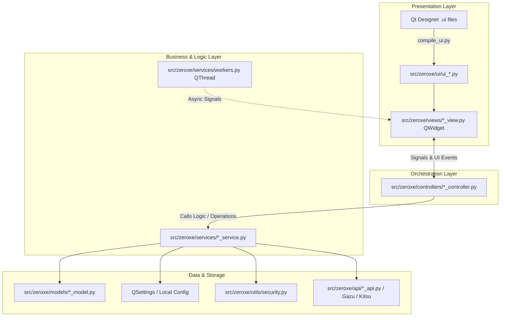

# ZeroXe Architecture & Development Guide

This document outlines the architectural patterns, folder structure, and coding standards for developing desktop applications in the **ZeroXe** codebase using Python and **PySide6**.

---

## 1. Architectural Overview

ZeroXe follows a decoupled **Layered MVC (Model - View - Controller - Service)** architecture.



### Golden Rules
1. **Never edit generated UI files (`src/zeroxe/ui/ui_*.py`) directly.** They will be overwritten when recompiled by `compile_ui.py`.
2. **`ui/` is not `views/`.** `ui/` contains auto-generated layout builders (`Ui_Form`). `views/` are real `QWidget` classes that assemble widgets, stack layouts, and configure Qt Item Models.
3. **Controllers coordinate UI actions.** Controllers connect widget signals to handlers, open file dialogs, validate user input, and delegate heavy lifting to Services.
4. **Services must remain Pure Python (No GUI imports).** Services do not import `QWidget` or `QPushButton`. They can be tested headlessly using `pytest`.
5. **Long operations must never block the Main GUI thread.** Use `QThread` workers for network calls (e.g. Gazu / Kitsu / downloads) or heavy disk I/O.
6. **Encrypt sensitive credentials locally.** Passwords and tokens stored on disk must be encrypted using `src/zeroxe/utils/security.py` before writing to `QSettings`.

---

## 2. Directory Structure & Responsibilities

```
ZeroXe/
├── assets/                    # Icons, stylesheets (.qss), static media
├── docs/                      # Developer documentation and guides
├── scripts/                   # Build, compilation, and packaging scripts
│   ├── compile_ui.py          # Auto-compiles ui/*.ui to src/zeroxe/ui/ui_*.py
│   ├── build_executable.py    # Standalone PyInstaller packager
│   └── build_appimage.sh      # Linux AppImage builder
├── ui/                        # Qt Designer source files (*.ui, *.qrc)
│   ├── launcher.ui
│   ├── settings.ui
│   ├── kitsu_setting.ui
│   └── software_setting.ui
└── src/
    └── zeroxe/
        ├── api/               # External API integrations (Gazu, Kitsu, HTTP APIs)
        ├── controllers/       # UI flow mediators & event handlers (SettingController)
        ├── models/            # Pure data classes / schemas / domain entities
        ├── services/          # Business logic, data processing, background workers
        ├── ui/                # Generated PySide6 Python UI files (DO NOT EDIT)
        ├── utils/             # Helper utilities (security/encryption, paths)
        ├── views/             # Custom QWidget / QMainWindow classes (View logic)
        ├── config.py          # App constants, environment settings, version info
        └── main.py            # Application entrypoint
```

---

## 3. Layer-by-Layer Implementation Guide

### Layer A: The Model (`src/zeroxe/models/`)
Models define the shape and types of your domain data. Use standard Python `@dataclass` or `pydantic`.

```python
# src/zeroxe/models/project_model.py
from dataclasses import dataclass, field
from typing import List, Optional

@dataclass
class Version:
    id: str
    name: str
    number: int
    file_path: str
    created_by: str

@dataclass
class AssetShotItem:
    id: str
    name: str
    item_type: str  # "Shot" | "Asset"
    status: str
    department: str
    versions: List[Version] = field(default_factory=list)

@dataclass
class Project:
    id: str
    name: str
    code: str
    items: List[AssetShotItem] = field(default_factory=list)
```

---

### Layer B: The Service (`src/zeroxe/services/`)
Services handle pure business logic, data persistence, and external execution with **zero Qt GUI dependencies**:
- Querying APIs (Gazu, Kitsu, REST)
- Reading/writing persistent configuration via `SettingsService`
- Launching external software (Blender, PureRef, Maya)
- Performing data transformations

```python
# src/zeroxe/services/settings_service.py
from typing import List
from PySide6.QtCore import QSettings
from zeroxe import config
from zeroxe.utils.security import decrypt_string

class SettingsService:
    @classmethod
    def _settings(cls) -> QSettings:
        return QSettings(config.ORGANIZATION_NAME, config.APP_NAME)

    @classmethod
    def get_kitsu_url(cls) -> str:
        return cls._settings().value("kitsu/url", config.KITSU_API_URL, type=str)

    @classmethod
    def get_kitsu_email(cls) -> str:
        return cls._settings().value("kitsu/email", "", type=str)

    @classmethod
    def get_kitsu_password(cls) -> str:
        """Retrieve and decrypt stored Kitsu password."""
        encrypted_pwd = cls._settings().value("kitsu/password_enc", "", type=str)
        return decrypt_string(encrypted_pwd)

    @classmethod
    def get_active_blender(cls) -> str:
        return cls._settings().value("software/active_blender", "", type=str)
```

---

### Layer C: The View (`src/zeroxe/views/`)
The View manages presentation and visual components:
- Initializes the compiled `Ui_Form`
- Combines child widgets or pages inside `QStackedWidget` / `QTabWidget`
- Configures Qt data models (`QStandardItemModel`, `QSortFilterProxyModel`)
- Instantiates its corresponding Controller

```python
# src/zeroxe/views/settings_view.py
from typing import Optional
from PySide6.QtWidgets import QStackedWidget, QWidget

from zeroxe.controllers.setting_controller import SettingController
from zeroxe.ui.ui_kitsu_setting import Ui_Form as KitsuSettingUi
from zeroxe.ui.ui_settings import Ui_Form
from zeroxe.ui.ui_software_setting import Ui_Form as SoftwareSettingUi

class SettingsView(QWidget):
    def __init__(self, parent: Optional[QWidget] = None):
        super().__init__(parent)
        self.ui = Ui_Form()
        self.ui.setupUi(self)

        # 1. Setup Stacked Sub-pages
        self.kitsu_widget = QWidget()
        self.kitsu_ui = KitsuSettingUi()
        self.kitsu_ui.setupUi(self.kitsu_widget)

        self.software_widget = QWidget()
        self.software_ui = SoftwareSettingUi()
        self.software_ui.setupUi(self.software_widget)

        self.stack = QStackedWidget()
        self.stack.addWidget(self.kitsu_widget)
        self.stack.addWidget(self.software_widget)
        self.ui.verticalLayout.addWidget(self.stack)

        # 2. Attach Controller
        self.controller = SettingController(self)
```

---

### Layer D: The Controller (`src/zeroxe/controllers/`)
The Controller bridges user actions from the View to backend Services:
- Wires button signals (`clicked`, `textChanged`, `itemClicked`)
- Opens UI dialogs (`QFileDialog`, `QMessageBox`)
- Encrypts sensitive inputs and saves configurations
- Populates View form fields upon loading

```python
# src/zeroxe/controllers/setting_controller.py
from PySide6.QtCore import QObject, QSettings
from PySide6.QtWidgets import QFileDialog, QMessageBox
from zeroxe import config
from zeroxe.utils.security import decrypt_string, encrypt_string

class SettingController(QObject):
    def __init__(self, view):
        super().__init__(view)
        self.view = view
        self.settings = QSettings(config.ORGANIZATION_NAME, config.APP_NAME)

        self._bind_signals()
        self.load_settings()

    def _bind_signals(self):
        self.view.ui.pushButton_apply.clicked.connect(self.on_apply)
        self.view.ui.pushButton_ok.clicked.connect(self.on_ok)
        self.view.software_ui.toolButton_locateBlender.clicked.connect(self.on_locate_blender)

    def load_settings(self):
        self.view.kitsu_ui.lineEdit_kitsuUrl.setText(
            self.settings.value("kitsu/url", config.KITSU_API_URL, type=str)
        )
        encrypted_pwd = self.settings.value("kitsu/password_enc", "", type=str)
        self.view.kitsu_ui.lineEdit_password.setText(decrypt_string(encrypted_pwd))

    def save_settings(self):
        raw_password = self.view.kitsu_ui.lineEdit_password.text().strip()
        self.settings.setValue("kitsu/password_enc", encrypt_string(raw_password))
        self.settings.sync()

    def on_apply(self):
        self.save_settings()
        QMessageBox.information(self.view, "Settings", "Settings saved successfully.")

    def on_locate_blender(self):
        file_path, _ = QFileDialog.getOpenFileName(self.view, "Locate Blender")
        if file_path:
            self.view.software_ui.lineEdit_kitsuUrl.setText(file_path)
```

---

## 4. Security & Credential Encryption (`src/zeroxe/utils/security.py`)

ZeroXe avoids storing raw plain-text credentials in config files or the Windows Registry.

- **PBKDF2 HMAC-SHA256**: Generates a 32-byte key derived from machine hardware (`uuid.getnode()`), current username (`getpass.getuser()`), and application identifiers.
- **XOR Stream Cipher**: Combines a 16-byte random salt with SHA-256 keystream encryption.
- **Base64 Packaging**: Outputs an opaque token (e.g. `OaWo7MLM...`) that cannot be decrypted outside the current user machine.
- **Zero External Dependencies**: Works out-of-the-box using the Python standard library.

---

## 5. Summary Cheat Sheet

| Component | Responsibility | Where it lives |
| :--- | :--- | :--- |
| **Qt UI Source** | Visual layout created in Qt Designer | `ui/*.ui` |
| **Compiled UI** | Python layout class (`Ui_Form`) generated by uic | `src/zeroxe/ui/ui_*.py` |
| **View** | Custom `QWidget`, tab/stack assembly, Qt Item Models | `src/zeroxe/views/` |
| **Controller** | Event handling, dialogs, form validation, service calls | `src/zeroxe/controllers/` |
| **Service** | API requests, launching software, persistent I/O | `src/zeroxe/services/` |
| **Security** | Machine-bound credential encryption/decryption | `src/zeroxe/utils/security.py` |
| **Model** | Data structures, type hints, dataclasses | `src/zeroxe/models/` |
| **Main Window** | Container window, menu bar, tabs | `src/zeroxe/views/main_view.py` |
