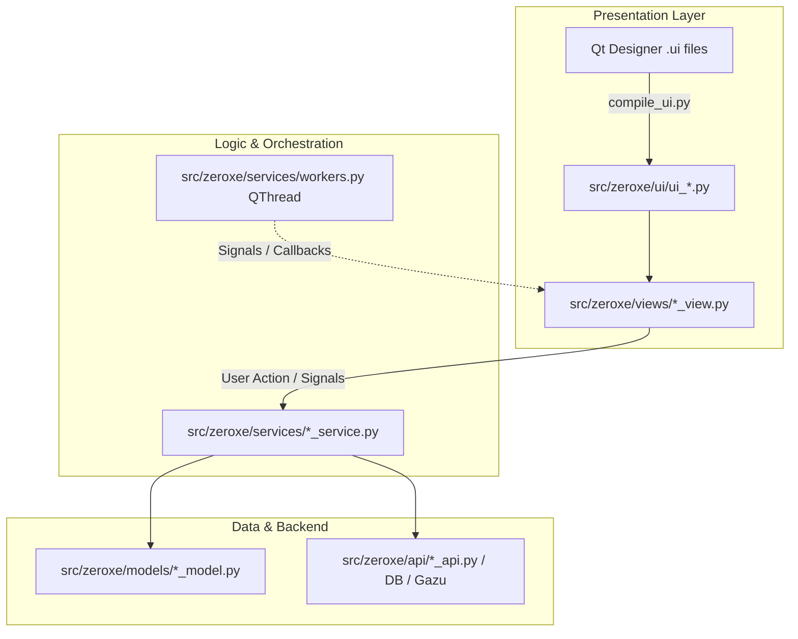
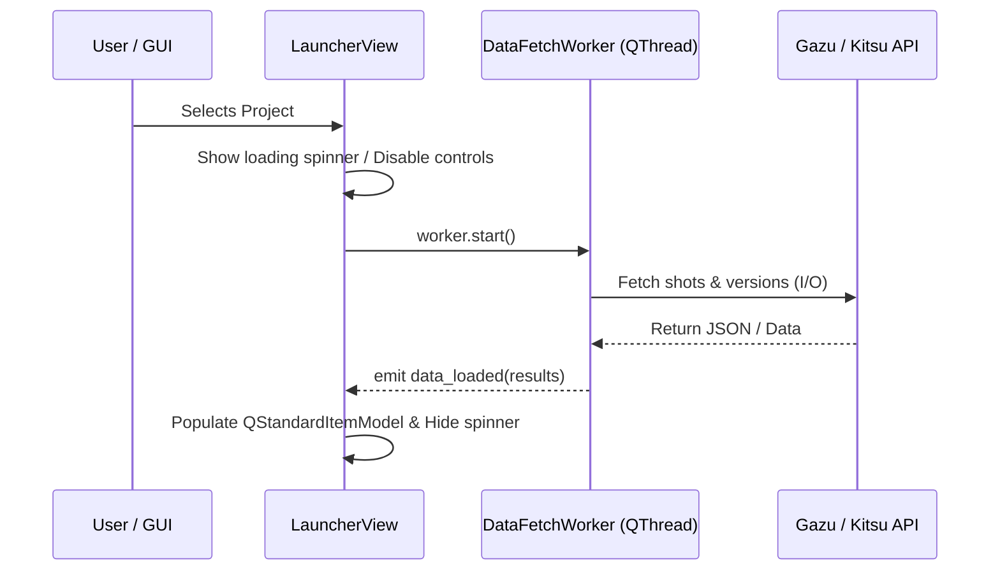

# ZeroXe Architecture & Development Guide

This document outlines the architectural patterns, folder structure, and coding standards for developing desktop applications in the **ZeroXe** codebase using Python and **PySide6**.

---

## 1. Architectural Overview

ZeroXe follows a decoupled **Layered MVC (Model-View-Controller/Service)** architecture.



### Golden Rules
1. **Never edit generated UI files (`src/zeroxe/ui/ui_*.py`) directly.** They will be overwritten when recompiled.
2. **The View must know nothing about database/API details.** The view only renders data passed to it and captures user interactions.
3. **Services must not import PySide6 UI widgets.** Services should remain pure Python to allow unit testing with `pytest` without a GUI session.
4. **Long operations must never block the Main GUI thread.** Use `QThread` or `QThreadPool` for network calls (e.g. Gazu / downloads) or heavy disk I/O.

---

## 2. Directory Structure & Responsibilities

```
ZeroXe/
├── assets/                    # Icons, stylesheets (.qss), static media
├── docs/                      # Developer documentation and guides
├── scripts/                   # Build, compilation, and automation scripts
│   ├── compile_ui.py          # Auto-compiles ui/*.ui to src/zeroxe/ui/ui_*.py
│   ├── build_executable.py    # Standalone PyInstaller packager
│   └── build_appimage.sh      # Linux AppImage builder
├── ui/                        # Qt Designer source files (*.ui, *.qrc)
│   └── launcher.ui
└── src/
    └── zeroxe/
        ├── api/               # External API integrations (Gazu, Kitsu, HTTP APIs)
        ├── models/            # Pure data classes / schemas / domain entities
        ├── services/          # Business logic, data processing, background workers
        ├── ui/                # Generated PySide6 Python UI files (DO NOT EDIT)
        ├── views/             # Custom QWidget / QMainWindow classes (View logic)
        ├── config.py          # App constants, environment settings, version info
        └── main.py            # Application entrypoint
```

---

## 3. Layer by Layer Implementation Guide

### Layer A: The Model (`src/zeroxe/models/`)
Models define the shape and types of your data. Use standard Python `@dataclass` or `pydantic`.

```python
# src/zeroxe/models/project_model.py
from dataclasses import dataclass, field
from typing import List, Optional

@dataclass
class Version:
    id: str
    name: str
    number: int
    file_path: str
    created_by: str

@dataclass
class AssetShotItem:
    id: str
    name: str
    item_type: str  # "Shot" | "Asset"
    status: str
    department: str
    versions: List[Version] = field(default_factory=list)

@dataclass
class Project:
    id: str
    name: str
    code: str
    items: List[AssetShotItem] = field(default_factory=list)
```

---

### Layer B: The Service / Data Processing (`src/zeroxe/services/`)
Services handle:
- Data fetching (Gazu / Kitsu / SQLite / REST)
- File system operations & path resolution
- Application execution (launching Maya, Blender, Houdini, etc.)
- Data transformations

```python
# src/zeroxe/services/project_service.py
from typing import List, Dict, Any
from zeroxe.models.project_model import Project, AssetShotItem

class ProjectService:
    @classmethod
    def get_projects(cls) -> List[Project]:
        """Fetch and parse projects into strongly-typed models."""
        # 1. Fetch raw data from API / Database / Mock
        raw_projects = [
            {"id": "p1", "name": "Cyberpunk_2026", "code": "CPK"},
            {"id": "p2", "name": "SciFi_Short", "code": "SFS"},
        ]
        # 2. Transform into domain models
        return [Project(id=p["id"], name=p["name"], code=p["code"]) for p in raw_projects]

    @classmethod
    def launch_dcc(cls, app_name: str, file_path: str) -> None:
        """Launch external DCC software."""
        import subprocess
        # Resolve application binary path and launch
        subprocess.Popen([app_name, file_path])
```

---

### Layer C: The View (`src/zeroxe/views/`)
The View is responsible for:
- Initializing the generated `Ui_Form` or `Ui_MainWindow`
- Setting up Qt Models (`QStandardItemModel`, `QSortFilterProxyModel`)
- Connecting widget signals (`clicked`, `textChanged`, `currentChanged`) to methods
- Calling Services to retrieve data and updating UI models

```python
# src/zeroxe/views/launcher_view.py
from PySide6.QtCore import Qt, QSortFilterProxyModel
from PySide6.QtGui import QStandardItem, QStandardItemModel
from PySide6.QtWidgets import QWidget, QButtonGroup, QAbstractItemView

from zeroxe.ui.ui_launcher import Ui_Form
from zeroxe.services.launcher_service import LauncherService

class LauncherView(QWidget):
    def __init__(self, parent=None):
        super().__init__(parent)
        self.ui = Ui_Form()
        self.ui.setupUi(self)

        # 1. Initialize Qt Models
        self.project_model = QStandardItemModel(self)
        self.ui.listView_project.setModel(self.project_model)

        # 2. Setup Search Filter Proxy Model
        self.item_source_model = QStandardItemModel(self)
        self.item_proxy_model = QSortFilterProxyModel(self)
        self.item_proxy_model.setSourceModel(self.item_source_model)
        self.item_proxy_model.setFilterCaseSensitivity(Qt.CaseSensitivity.CaseInsensitive)
        self.ui.listView_assetList.setModel(self.item_proxy_model)

        # 3. Connect Signals
        self._setup_signals()

        # 4. Populate Initial Data
        self._load_projects()

    def _setup_signals(self):
        # Instant search filtering
        self.ui.lineEdit_searchAsset.textChanged.connect(
            self.item_proxy_model.setFilterFixedString
        )
        # Selection changed
        self.ui.listView_project.selectionModel().currentChanged.connect(self._on_project_selected)

    def _load_projects(self):
        self.project_model.clear()
        projects = LauncherService.get_projects()
        for p in projects:
            item = QStandardItem(p["name"])
            # Store full data object in UserRole
            item.setData(p, Qt.ItemDataRole.UserRole)
            self.project_model.appendRow(item)

    def _on_project_selected(self, current, previous):
        if not current.isValid():
            return
        project_data = current.data(Qt.ItemDataRole.UserRole)
        # Fetch items via Service and update view...
```

---

## 4. Asynchronous Execution Pattern (Background QThread)

Never perform network requests or long-running computations directly on the main GUI thread. Use `QThread` workers to keep the interface smooth and responsive.



### Worker Implementation Template:
```python
from PySide6.QtCore import QThread, Signal

class DataFetchWorker(QThread):
    data_loaded = Signal(list)
    error_occurred = Signal(str)

    def __init__(self, project_id: str):
        super().__init__()
        self.project_id = project_id

    def run(self):
        try:
            # Heavy I/O or network API call in background
            items = LauncherService.get_items(self.project_id, "Shot")
            self.data_loaded.emit(items)
        except Exception as e:
            self.error_occurred.emit(str(e))
```

---

## 5. Summary Cheat Sheet

| Component | Responsibility | Where it lives |
| :--- | :--- | :--- |
| **Qt UI Source** | Visual layout created in Qt Designer | `ui/*.ui` |
| **Compiled UI** | Python class (`Ui_Form`) generated by uic | `src/zeroxe/ui/ui_*.py` |
| **Model** | Data structures, type hints, dataclasses | `src/zeroxe/models/` |
| **Service** | API requests, database queries, logic, file I/O | `src/zeroxe/services/` |
| **Worker** | Non-blocking background threads (`QThread`) | `src/zeroxe/services/` |
| **View** | Widget event wiring, Qt models, UI updates | `src/zeroxe/views/` |
| **Main Window** | Container window, menu bar, tabs | `src/zeroxe/views/main_view.py` |
